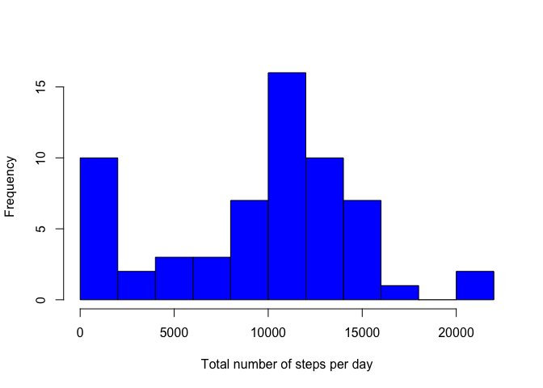
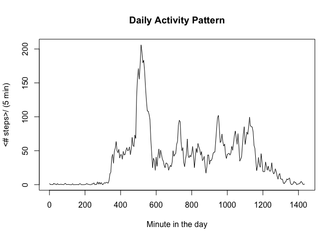
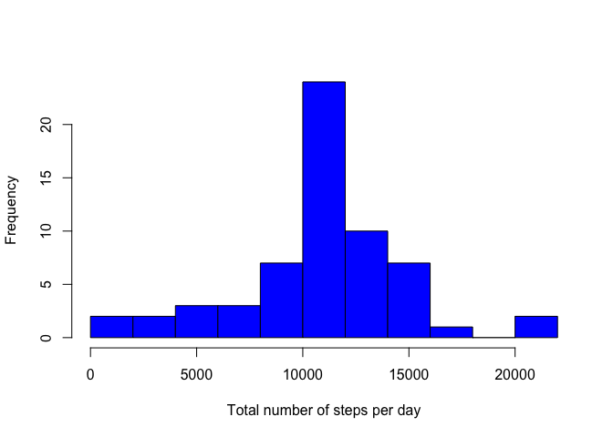
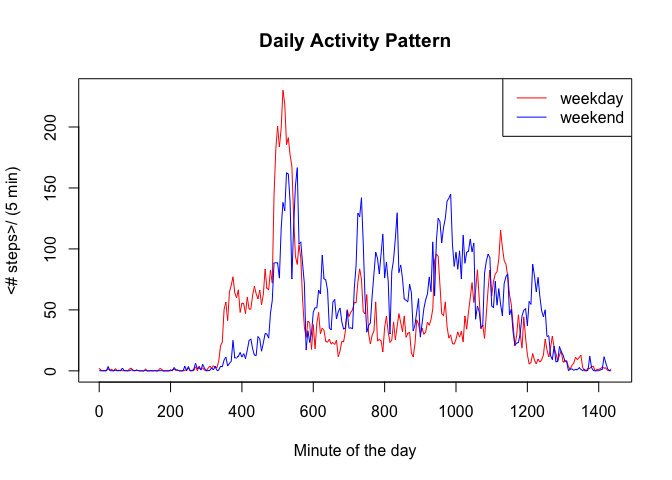

# Reproducible Research: Peer Assessment 1
Jonathan Stahlman  


## Loading and preprocessing the data

Data are loaded from the input file using read.csv.  An extra column is computed which represents the 'start' time of each 5 minute interval because the interval variable numbering contains 'gaps' which are not so nice for plotting time series:

```r
data <- read.csv('activity.csv')
data['minute'] <- lapply(data['interval'],function(x){as.integer(x/100)*60 + x%%100})
```

## What is mean total number of steps taken per day?

The total number of steps is calculated for each day (after removing NA values):

```r
total_steps <- tapply(data$steps, data$date, sum, na.rm=TRUE)
```

The mean, median, and histogram are calculated:

```r
mean_steps <- mean(total_steps)
median_steps <- median(total_steps)
hist(total_steps, breaks=9, xlab='Total number of steps per day', main='', col='blue')
```

 

The mean number of steps per day is 9354 steps and the median number of steps per day is 10395 steps.

## What is the average daily activity pattern?

The daily activity pattern is studied using the mean of the number of steps in each time interval:

```r
avg_data <- aggregate(data['steps'], data['minute'], mean, na.rm=TRUE)
plot(avg_data, xlab='Minute in the day',ylab='<# steps>/ (5 min)', main='Daily Activity Pattern', type='l')
```

 

The interval with the largest average number of steps is determined:

```r
avg_data2 <- aggregate(data['steps'], data['interval'], mean, na.rm=TRUE)
max_interval <- avg_data$minute[which.max(avg_data$steps)]
max_interval2 <- avg_data2$interval[which.max(avg_data2$steps)]
```

and the result is interval number 835, corresponding to minute 515.

## Imputing missing values

The number of days with missing values ('NA') is calculated:

```r
inc <- !complete.cases(data)
n_incomplete <- sum(inc)
```
There are 2304 days with missing values.

Next, a new dataset is created where the missing values are replaced by the average number of steps over all days for that particular interval:

```r
data_ex <- data
data_ex[inc,'steps'] <- sapply(data_ex[inc,'interval'], function(x){ avg_data2[avg_data2['interval']==x,'steps'] })
```

The mean, median, and histogram are calculated for the dataset with the replaced values:

```r
total_steps_ex <- tapply(data_ex$steps, data_ex$date, sum, na.rm=TRUE)
mean_steps_ex <- mean(total_steps_ex)
median_steps_ex <- median(total_steps_ex)
hist(total_steps_ex, breaks=9, xlab='Total number of steps per day', main='', col='blue')
```

 

The mean number of steps per day is 10766 steps and the median number of steps per day is 10395 steps.  The mean is 15% higher and the median is 3% higher than when the missing values were removed from the calculation. A comparison of the histograms reveals that there were several days in the lowest bin which migrated to higher bins after replacing their NA values with the average values.  This indicates that these days were most likely missing data at times of the day when the average step count is large.

## Are there differences in activity patterns between weekdays and weekends?

First, we add a factor to indicate whether a day is a weekday or a weekend day:


```r
data_ex['day'] <- as.factor(sapply(weekdays(as.Date(data_ex$date)), function(x){ if (x=="Sunday" || x=="Saturday"){"weekend"} else "weekday"}))
```

Next we calculate the average number of steps separately for weekdays and weekends:

```r
avg_data_week <- aggregate(steps~minute+day, data_ex, mean)
```

and then plot the result:

```r
plot(avg_data_week[ avg_data_week['day'] == 'weekday',c(1,3)], xlab='Minute of the day',ylab='<# steps>/ (5 min)', main='Daily Activity Pattern', type='l',col='red')
lines(avg_data_week[ avg_data_week['day'] == 'weekend',c(1,3)],col='blue')
legend('topright', c('weekday','weekend'),lty=1, col=c('red','blue'))
```

 

Large differences in the daily pattern are observed between the weekend and weekday data.
